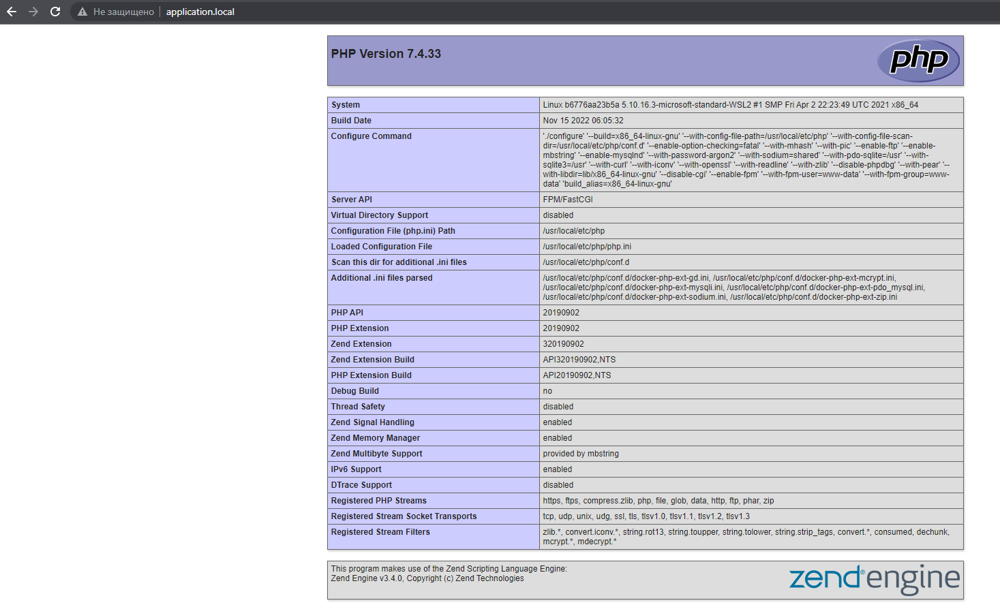

# Сборка Docker PHP-FPM + NGINX +MYSQL

## Установка

1. Установите [Docker](https://docs.docker.com/get-docker/) 
2. Установите [WSL2](https://learn.microsoft.com/ru-ru/windows/wsl/install)
3. Скачайте (или воспользуйтесь командой "git clone https://github.com/Kub0yd/Docker-PHP.git") файлы на устройство
4. Задайте логин и пароль в файле [env_example](./env_example), переменуйте его в файл: .env
5. Выполните команду:

         docker-compose up -d

Рабочий пример:
